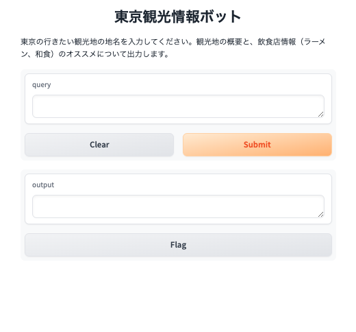
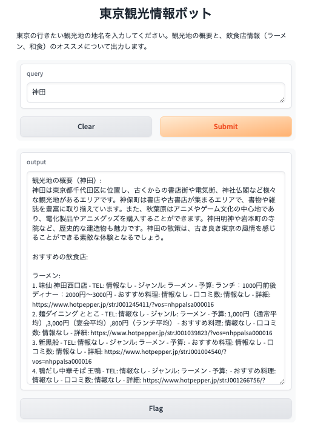

# 東京観光情報ボット

このプロジェクトは、東京の観光地や飲食店に関する情報を提供する ChatGPT とホットペッパー API を利用した情報提供 BOT です。ユーザーが地名を入力すると、その地域の観光地の概要とおすすめの飲食店情報を取得できます。

## 機能

- **観光地の概要**: ChatGPT API を使用して、指定された地名の観光地の概要を 200 文字で提供します。
- **飲食店情報**: ホットペッパー API を使用して、安価でおすすめの飲食店（大衆向け）の情報を提供します。表示される情報には店舗名、TEL、ジャンル、価格帯、おすすめ料理、URL が含まれます。

## 環境設定

このプロジェクトを実行する前に、以下の環境設定が必要です。

1. **Python のインストール**: Python 3.11.3 をインストールしてください。
2. **ライブラリのインストール**:
   必要な Python ライブラリをインストールします。

   pip install gradio openai requests python-dotenv

3. **環境変数の設定**:
   `.env` ファイルをプロジェクトのルートディレクトリに作成し、以下の内容を追加します。

   OPENAI_API_KEY=your_openai_api_key_here
   HOT_PEPPER_API=your_hot_pepper_api_key_here

## アプリケーションの起動

以下のコマンドを実行して、Gradio インターフェースを起動します。
python main.py

## 使用方法

Web ブラウザで表示された Gradio インターフェースにアクセスし、テキストボックスに地名を入力して「submit」ボタンを押すと、観光地の概要と飲食店情報が表示されます。

## トラブルシューティング

- **API キーが無効**: `.env` ファイルに正しい API キーが設定されていることを確認してください。
- **ライブラリが見つからない**: 必要なライブラリがすべてインストールされていることを確認し、必要に応じて再インストールしてください。
- **Gradio が起動しない**: コマンドプロンプトまたはターミナルでエラーメッセージを確認し、指示に従って問題を解決してください。

## コード

主要な機能は以下のファイルに実装されています。

- `main.py`: Gradio インターフェースと API の呼び出しを管理 ([main.py:1-74](main.py))
- `api_handlers.py`: 外部 API からデータを取得する関数を定義 ([api_handlers.py:1-49](api_handlers.py))

## アプリケーションの画面

### 入力前の画面

### 入力後の画面

